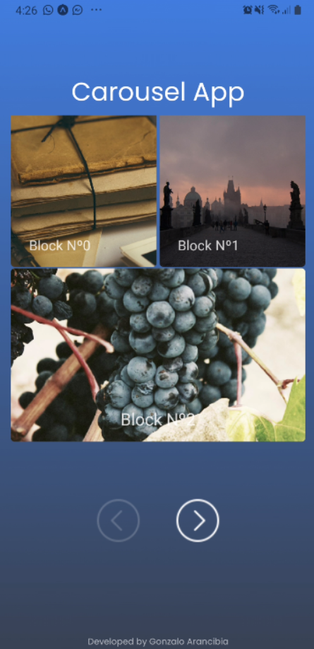

# Carousel-App

# Challenge - Puzzle 

  

## Objetivos del Challenge

Cree una aplicación con una sola pantalla que contenga un carrusel, sin utilizar bibliotecas o complementos de "carrusel" existentes.

Requerimientos:
- Construye un carrusel.
- De forma predeterminada, muestra 4 o 3 bloques a la vez.
- La navegación se realiza con los botones siguiente y anterior.
- El botón Siguiente debe estar deshabilitado, si el usuario está al final del carrusel.
- El botón Anterior debe estar deshabilitado, si el usuario se encuentra al principio del carrusel.
- Al hacer clic en los botones siguiente / anterior, se muestran los siguientes / previos 4 o 3 bloques de carrusel en consecuencia.

## Demo

   

## Duracion

-El challenge se realizo en una duración de 2 dias.
-Para correr el proyecto clonar el repositorio , luego ir dentro del repositorio para colocar en terminal npm install y por ultimo npm start. Ya funcionando la app hay que conectarse a travez de un telefono descargandose expo en play store para iniciar expo donde podemos acceder a nuestra aplicacion.

Developed by Gonzalo Arancibia
